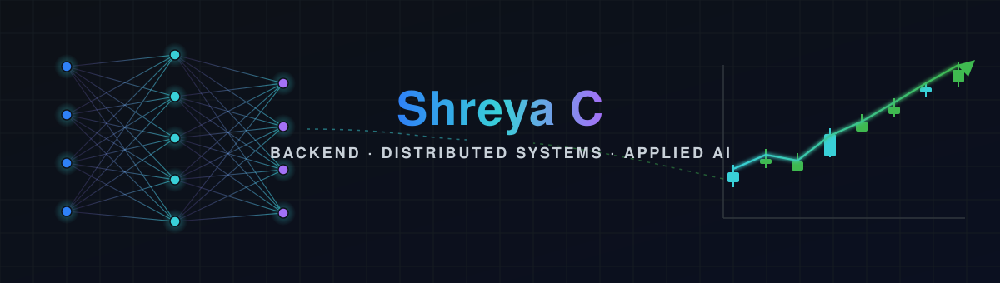

<!--
  ┌────────────────────────────────────────────────────────────────────┐
  │  GitHub Profile README for Shreya Chinthala                         │
  │  HOW TO USE:                                                        │
  │  1. Create a repo named EXACTLY your GitHub username                │
  │     (e.g. github.com/shreyachinthala/shreyachinthala)              │
  │  2. Put this file in it as README.md                               │
  │  3. Commit the assets/ folder too (header.svg lives there)         │
  │  4. Replace every  YOUR_GITHUB_USERNAME  and the LinkedIn URL       │
  │  Note: GitHub strips <style>/CSS/JS from READMEs, so the visual     │
  │  richness here comes from badges, image services, and the committed │
  │  SVG banner — this is the professional, actually-renders approach.  │
  └────────────────────────────────────────────────────────────────────┘
-->

<div align="center">

<!-- ░░░ CUSTOM SVG MOOD BANNER (neural network → rising chart: AI + fintech) ░░░ -->


<!-- ░░░ ANIMATED TAGLINE ░░░ -->
<a href="https://git.io/typing-svg">
  
</a>

<!-- ░░░ QUICK STATS + SOCIAL ░░░ -->
<p>
  
  &nbsp;
  <a href="mailto:shreya79c@gmail.com"></a>
  <a href="https://www.linkedin.com/in/shreya-c-865026394/"></a>
  
</p>

</div>

---

##  whoami

```python
class ShreyaChinthala:
    def __init__(self):
        self.role       = "Software Engineer"
        self.focus      = ["Distributed Systems", "Cloud-Native Backend", "Applied GenAI"]
        self.stack      = ["Java", "Spring Boot", "Python", "FastAPI", "Kafka"]
        self.superpower = "wiring RAG + MCP into real distributed systems"
        self.education  = "MS CS, Santa Clara - AI & Scalable Distributed Systems"

    def what_i_do(self):
        return "design event-driven microservices that stay correct under load, " \
               "then teach them to reason with AI - without breaking governance."
```

I build the unglamorous half of software that has to be right: exactly-once payment ledgers, idempotent APIs, zero-downtime key rotation. Lately I bring the same rigor to **AI on the backend** - governed RAG pipelines, Model Context Protocol tooling, and semantic caching that cuts model cost.

---


##  Current focus

- 🔭 **Building** secure AI features with **Azure OpenAI · LangChain · RAG**, connected to enterprise workflows over the **Model Context Protocol (MCP)**
- ⚡ **Scaling** event-driven services on **Apache Kafka** with an eye on p99 latency and throughput
- 🔐 **Hardening** APIs with **Entra ID · OAuth 2.0 · JWT · Key Vault**
- 📈 **Watching** everything through **OpenTelemetry · Prometheus · Grafana**
- 🌱 **Learning deeper** vector search (**pgvector**) and agentic patterns (**LangGraph**)

---

##  Building blocks

<div align="center">

**Languages & Backend**


**Distributed Systems & Data**


**Generative AI**


**Cloud & DevOps**


**Observability & Security**


</div>

---

##  Proficiency status bar

<div align="center">

| Domain | Level | Signal |
|:---|:---|:---|
| **Java / Spring Boot Microservices** | `██████████` Senior | 3+ yrs, Microsoft + JPMorgan production systems |
| **Distributed Systems & Kafka** | `█████████░` Advanced | Event-driven, exactly-once, chaos-tested |
| **Cloud-Native (Docker / K8s / CI-CD)** | `█████████░` Advanced | AKS/EKS, GitHub Actions, Jenkins |
| **Applied GenAI (RAG / MCP / pgvector)** | `████████░░` Strong | Shipping AI features at Microsoft |
| **Python / FastAPI** | `████████░░` Strong | AI service layer, tooling |
| **Observability (OTel / Prom / Grafana)** | `████████░░` Strong | Production monitoring & incident response |

</div>

---

##  Featured case studies

Recruiter-grade, benchmarked, and honestly documented - each solves one expensive problem.

<div align="center">

| Project | What it proves | Stack |
|:---|:---|:---|
| **[llm-guard-gateway](https://github.com/ShreyAC962/llm-guard-gateway)** | Prompt-injection firewall + semantic cache: p50 44 ms → 4.6 ms | FastAPI · pgvector · MCP |
| **[txn-exactly-once-ledger](https://github.com/ShreyAC962/txn-exactly-once-ledger)** | 46 process kills, 0 lost, 0 double-applied transfers | Postgres · Kafka · outbox |
| **[cdc-read-model-projector](https://github.com/ShreyAC962/cdc-read-model-projector)** | Byte-identical replay; fixes the out-of-order-commit CDC bug | Postgres · CQRS · CDC |
| **[saga-chaos-lab](https://github.com/ShreyAC962/saga-chaos-lab)** | 7 crash points, 7 consistent recoveries | Saga · chaos engineering |

</div>

<div align="center">
  
</div>

---

##  Beyond the code

<div align="center">

`📄 distributed-systems papers` &nbsp; `🧩 system-design puzzles` &nbsp; `🤖 tinkering with AI agents` &nbsp; `🛠️ open-source` &nbsp; `☕ over good coffee`


</div>

---

<div align="center">

## 🤝 Quick connect

<a href="https://www.linkedin.com/in/shreya-c-865026394/"></a>
<a href="mailto:shreya79c@gmail.com"></a>
<a href="https://github.com/ShreyAC962"></a>

<br/><br/>


<sub>⭐ <b>Open to backend / distributed-systems / AI-platform roles.</b> If a repo here is useful, a star means a lot.</sub>

</div>
